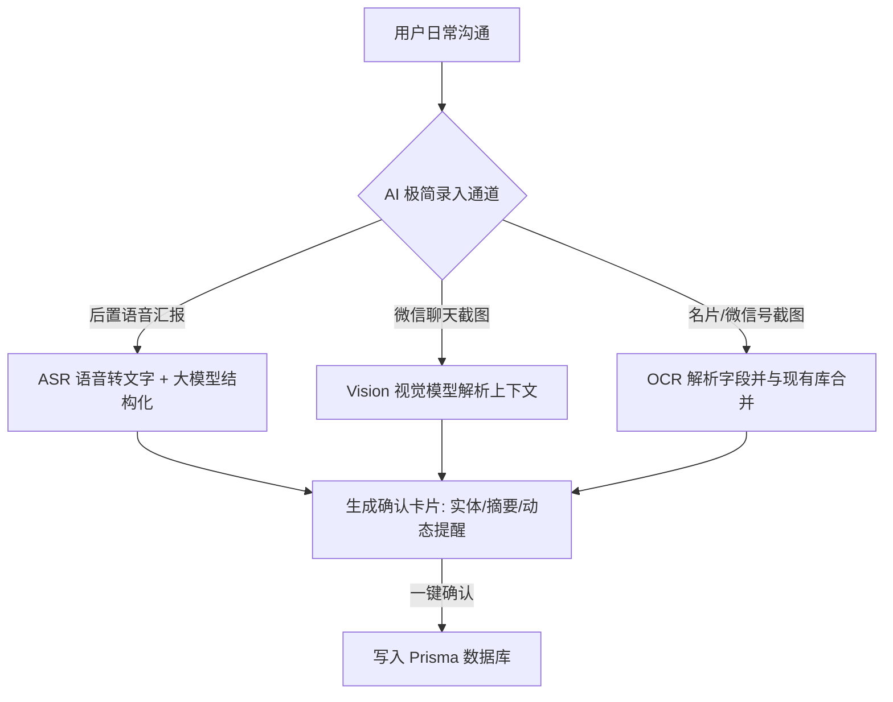

# 「常联系 (ChangLianXi)」个人 CRM 深度市场调研与产品落地规划报告

本报告综合分析了全球与国内个人 CRM（人脉管理）市场竞品，梳理了用户流失的深层痛点与期望，并为「常联系」项目制定了清晰、可落地的 AI 原生产品规划与商业化路线图。

---

## 一、 竞品分析与市场格局

目前，个人 CRM 领域的主要玩家分为国外设计驱动型产品、开源私有化产品以及国内本土化营销工具。

### 1.1 核心竞品对比矩阵

| 维度 | Mesh (原 Clay) | Dex | Folk | Monica | 懒牛人脉 | 常联系 (本项目) |
| :--- | :--- | :--- | :--- | :--- | :--- | :--- |
| **主要定位** | 商务精英人脉中心 | 主动型联系周期管理 | 团队协同轻量级 CRM | 开源私有隐私管理 | 销售拓客/群发工具 | **AI原生、零录入个人CRM** |
| **核心客群** | VC、创始人群体 | 自由职业者、职场人 | 早期创业团队、VC | 隐私极客、技术人员 | 中小商户、地方销售 | **高价值人脉网络维护者** |
| **主要功能** | 全自动社交/邮件同步 | 社交网络浏览器插件 | 协同看板、邮件序列 | 日记、送礼、琐事记录 | 名片OCR、短信个性群发 | **语音/截图AI提取、智能提醒** |
| **AI 能力** | 自然语言搜索、新闻监测 | 会前简报 AI 助手 | 基础自动归档 | 无 | 无 | **多模态AI输入、关系评分** |
| **微信集成** | 无 | 无 | 无 | 无 | 仅本地通讯录导入 | **深度无风险辅助（截图/剪贴板）** |
| **收费模式** | 免费限制 / Pro约 $10/月 | 纯付费，约 $12/月 | 团队收费，约 $20/人/月 | 开源免费 / 托管约 $9/月 | 免费下载 + VIP 内购 | **免费限制 / Pro约 ¥19/月 (¥168/年)** |
| **前端形态** | Web / iOS (主) | Web / iOS / Chrome | Web (无移动端) | Web / 基础 iOS | Android (主) / 小程序 | **多端应用：小程序 & H5 & 独立 App (基于 uni-app)** |

### 1.2 竞品优缺点深度剖析

#### 1. Mesh (原 Clay.earth)
* **优势**：极佳的 UI/UX 设计，能与 Google Calendar、LinkedIn、Email 深度对接，实现背景信息自动抓取与动态更新。
* **劣势**：高月费（年付折合约 $10/月）；对中文社交生态（尤其是微信）完全不支持；移动端功能较弱，属于典型的“被动存储型”工具。

#### 2. Dex
* **优势**：专注于人脉维护的“接触周期”，其 Chrome 浏览器插件可以非常便捷地在 LinkedIn、Twitter 网页端一键抓取联系人并同步到后台。
* **劣势**：已全面转向纯付费制，流失了大量免费用户；在没有浏览器插件的移动端（微信生态）体验大打折扣。

#### 3. Folk
* **优势**：把人脉管理做成了像 Notion/Airtable 一样自由的在线表格，支持团队协作、Kanban 看板以及批量发送邮件序列（Sequences），非常适合小团队。
* **劣势**：无移动 App，价格极高（$20+/月/人），对个人维护人脉来说过于沉重。

#### 4. Monica
* **优势**：开源、可自建（Self-hosted），用户数据完全归自己所有，支持记录极其琐碎的个人关系细节（如朋友的宠物名字、喜欢的食物、送礼记录等）。
* **劣势**：UI 较为简陋；缺乏任何自动化输入与外部集成；部署门槛对非技术人员过高。

#### 5. 懒牛人脉
* **优势**：国内本土产品，核心功能为名片 OCR 和批量发送短信（可自动插入联系人称呼）。
* **劣势**：界面陈旧；缺乏大模型支持，无法进行语音或聊天记录分析；索取联系人、通话记录等过多敏感权限，隐私隐患大。

### 1.3 核心痛点与刚需用户画像排行

并非所有拥有社交网络的人都需要个人 CRM。普通社交用户用微信标签就足够了。只有当**“人脉关系直接关联其商业回报，且人脉维护的精度和体量超出人类自然记忆极限”**时，个人 CRM 才是刚需。

以下是痛点最深、付费意愿最高的三类核心用户画像：

#### Rank 1: 高净值客户服务经理（私人银行/高端财富管理/高端保险/信托顾问）
* **痛点深度**：★★★★★ | **付费意愿**：★★★★★
* **用户痛点**：
  * **记错信息代价巨大**：客户非富即贵，记错客户的喜好（如茶道偏好、子女专业、特定疾病史）或漏掉客户及家人的农历生日，将直接导致客户流失。
  * **极高隐私要求**：因合规和行业竞争，他们绝对不能在公司 CRM（如 Salesforce）里详细记录客户非常私人的谈话（如家庭矛盾、资产继承意向）。
  * **中式人脉维护高频**：极度依赖红白喜事、农历节日、升学结婚等节点的动态关怀。
* **AI 关键诉求**：极高隐私的本地/云盘加密备份；农历生日精准倒计时；AI 自动提取聊天中客户提到的家庭琐事（如“大女儿9月去英国”）。

#### Rank 2: 投资人与金融顾问（VC/PE/早期创投/FA/券商分析师）
* **痛点深度**：★★★★★ | **付费意愿**：★★★★☆
* **用户痛点**：
  * **信息过载，时间极度碎片化**：每周接触数十个项目创始人与行业专家，会后只有几分钟空余，完全没有精力去系统录入备忘。
  * **关系链复杂**：需要记住“谁是谁推荐的”、“谁在哪个赛道有深厚背景”、“谁是某项目的早期天使”。
  * **人脉直接变现**：寻找案源（Deal sourcing）和专家咨询时，需要进行跨维度的快速人脉联络。
* **AI 关键诉求**：**会后语音速记一键生成（ASR+LLM）**；自然语言语义检索（如：“帮我找一个之前认识的、做半导体的、在上海的投资人”）。

#### Rank 3: 高级猎头与管理咨询顾问
* **痛点深度**：★★★★☆ | **付费意愿**：★★★★☆
* **用户痛点**：
  * **长周期跟进摩擦**：优质候选人或客户通常需要维持 1-3 年的长期温度，无法通过普通的招聘系统进行情感化追踪。
  * **动态丰富度高**：候选人的职业状态变化（想离职、已晋升、准备创业）往往隐藏在微信的朋友圈或聊天互动中。
* **AI 关键诉求**：聊天截图 Vision 解析（快速提取候选人最近的职业想法变化）；智能 Nudge 提醒（AI 自动提示：“该候选人入职新公司已满 3 个月，建议发消息关怀其转正情况”）。

#### Rank 4: 商务拓展与初创公司创始人（BD/Partnerships/Founders）
* **痛点深度**：★★★★☆ | **付费意愿**：★★★☆☆
* **用户痛点**：
  * **非结构化微信聊天过多**：每天在微信上处理数十个合作伙伴的诉求，口协议多，极易遗忘沟通中承诺的“下周给方案”、“下个月引荐某人”等行动项。
* **AI 关键诉求**：剪贴板微信历史一键分析与行动项自动提取。

### 1.4 产品哲学：“如 AI 自动沉淀开发文档，AI 亦在自动沉淀你的人脉资产”

正如我们在使用 `agy` 结对编程的沟通过程中：**你只管专注提出想法、讨论业务，而背后的 AI 会自动把零散的聊天信息实时提炼、分析并沉淀为规整的项目文档**一样——

**「常联系」的核心产品哲学也完全一致：**
用户只需要专注地去与人连接、真诚交流、喝茶闲聊，而背后的 AI 伴侣会默默把这些非结构化的谈话细节，自动转化为结构化的「人脉资产」与「关系时间轴」。
这种**“你负责真实社交，AI 负责数字沉淀”**的默契协作，才是真正能够对抗社交惰性、免除录入痛苦，让这个产品产生持久生命力的**“终极价值说明书”**。

---

## 二、 用户痛点与流失根源（Why People Quit）

通过网络反馈（如 Reddit、V2EX、小红书）以及各应用商店的差评分析，个人 CRM 用户流失的真正痛点在于：

1. **手动录入疲劳 (Manual Entry Fatigue - 致命伤)**  
   用户需要自己打字记录“今天和谁喝了咖啡”、“聊了什么”、“她女儿要考哪所大学”。一旦工作繁忙，中断更新两三周，系统数据就会失效，用户随即彻底放弃。
2. **“被动数据库”陷阱 (The Passive Trap)**  
   许多工具只是把联系人存起来，没有主动提供智能的 reconnect（重新联系）建议。用户觉得这和系统通讯录、Excel 没区别，失去了打开 App 的动力。
3. **工作流割裂 (Workflow Disconnection)**  
   工具无法与真正的交流场所（如微信）无缝打通。信息在微信里，记录在 CRM 里，两者之间巨大的复制粘贴摩擦让用户感到繁琐。
4. **隐私泄露担忧 (Privacy & Security)**  
   国外的全自动关联需要绑定个人邮箱和日历。国内用户对于将微信聊天记录或敏感商业人脉上传到云端并由 AI 解析存在天然防备心理。

---

## 三、 「常联系」AI 原生解决方案

针对上述痛点，「常联系」定位为**多端、全生态的个人人脉中心**，核心设计以 **“零打字 (Zero-Typing)”**、**“跨生态安全辅助”** 以及 **“不限于单一生态的多平台扩展能力”** 作为核心突破口。



### 3.1 语音速记输入管线（Meeting Debrief）
* **场景**：与客户在咖啡厅聊完出来，用户只需按住小程序录音 20 秒，用语音快速念一段大白话：
  > “刚才跟腾讯的李强喝了茶，他说他们团队最近在招高级前端。另外他下个月要去新加坡度假。提醒我 3 周后问问他前端招聘进度。”
* **技术实现**：
  1. 小程序录音并上传音频文件。
  2. 后端调用腾讯云 ASR 或 Whisper 进行语音转文字。
  3. 将文本送入大模型（如 `qwen-2.5-72b` 或 `deepseek-v3`），配合特定 Prompt 提取出：
     * **目标联系人**：李强（公司：腾讯）
     * **交互记录**：喝茶交流；得知其下个月将去新加坡度假；团队正在招聘高级前端。
     * **提醒事项**：3 周后（自动换算为绝对日期，如 2026-06-29）提醒跟进“前端招聘进度”。
  4. 前端展示提取结果卡片，用户点选“确认无误”即可一键录入。

### 3.2 跨平台安全“伴侣型”工作流 (以微信为核心，兼容全生态)
任何强行自动读取微信、WhatsApp等平台私有协议的工具都面临封号和隐私风险。我们采用 **“无害半自动伴侣模式”**，并在不同客户端平台提供最契合的原生体验：

* **微信小程序端/H5端：**
  * **机制 A：剪贴板智能嗅探 (Flomo 模式)**：复制聊天记录后打开小程序，通过接口嗅探剪贴板内容，AI 自动整理归档。
  * **机制 B：截图 OCR 归档**：用户上传微信个人资料卡截图或聊天记录截图，Vision 大模型自动提取姓名、微信号、背景备注及行动提醒。
* **独立 App 端 (iOS / Android)：**
  * **机制 C：系统级 Share Extension (共享插件)**：用户在微信、企业微信、飞书、WhatsApp 中直接选中一段文字或图片，点击系统“分享”，直接调用「常联系」的 Share Extension，无需切换 App 即可完成静默录入。
  * **机制 D：智能通知栏快速捕获 (仅Android)**：用户授权后，App 可对通讯软件的通知进行过滤，如果是设定好的星标联系人，会在通知栏下方生成“快速录入备忘”快捷按钮，一键调起语音转录。

---

## 四、 核心算法与特色功能设计

### 4.1 动态关系健康评分算法 (Relationship Health Score - RHS)
系统不能只是机械地按照“到期倒计时”来提醒，而应通过算法计算人脉的“亲疏度”，并进行智能排序。

$$\text{RHS} = \text{BaseScore} \times e^{-\lambda t} + \text{SentimentModifier}$$

* **$\text{BaseScore}$（基础分）**：由最后一次互动形式决定。
  * 线下见面 / 深度通话：$100$ 分。
  * 微信互动：$60$ 分。
  * 节日群发 / 点赞：$20$ 分。
* **$t$**：距离最后一次联系过去的天数。
  * **$\lambda$ (衰减系数)**：根据用户设定的期望联系频率（$F$，默认 90 天）动态调整：
    $$\lambda = \frac{\ln(2)}{F}$$
    *（确保当时间过去 $F$ 天时，基础分值刚好衰减一半）。*
* **$\text{SentimentModifier}$（情感加成）**：AI 对沟通日志进行情感分析，发现表达感谢、合作倾向则 $+10$ 分；若发现客户有痛点、抱怨或紧急求助，则触发预警提醒，不受衰减曲线限制。

### 4.2 农历生日提醒引擎
国内商务关系中，许多传统老板、长辈及地方合作伙伴过的是**农历（阴历）生日**。
* **技术实现**：
  1. 数据库支持存储 `birthdayLunarMonth`（农历月）、`birthdayLunarDay`（农历日）以及布尔值 `isBirthdayLunar`。
  2. 后端每日定时任务（Cron）调用 `lunar-javascript` 开源库，将每个农历生日动态换算为**当年的公历日期**。
  3. **多阶段推送**：
     * **提前 3 天**：推送订阅消息，提示“周总农历生日将在3天后，建议提前准备贺卡或礼品”。
     * **当天上午 9 点**：推送消息，并由 AI 自动生成一句贴合其行业背景的温和问候语供用户一键复制发送。

### 4.3 AI 高情商“嘴替”助手（职场、恋爱、家庭社交解围）
年轻一代在职场、恋爱和家庭关系中常常面临“社交焦虑”或“沟通困境”（不知道如何得体回复、怕说错话）。「常联系」可以将关系管理从被动的“记录”延伸到主动的“沟通赋能”：

* **场景痛点：**
  * **职场**：如何体面地拒绝老板周末加班要求？如何委婉地催促同事交付报告？
  * **恋爱**：相亲对象发来“吃了吗”，如何有趣地破冰？对方说“我没事”时如何高情商回复？
  * **家庭**：亲戚开口借钱怎么拒绝不伤和气？过年回家被催婚怎么幽默应答？
* **AI 嘴替解决方案（Vision + Context）：**
  1. **聊天截图一键求助**：用户截屏微信对话，上传至小程序的“求助嘴替”版块。
  2. **关系上下文融合**：区别于通用 AI（如 ChatGPT），「常联系」可以**调取该联系人在 CRM 中的历史记录**（如：它是你的直属领导、还是刚相亲认识3天的对象、或者是二舅）。
  3. **高情商话术生成**：Vision 大模型读取聊天语境，结合关系背景，自动给出 3 种不同风格的回复选项（如：**委婉得体、专业高冷、幽默化解**），用户一键复制使用。
  * **价值**：这是一个**极高频、极具病毒传播效应的刚需功能**，能帮助小程序从“低频记录工具”一跃成为年轻人的“高频社交护身符”。

#### 4.3.1 “AI嘴替”技术数据流与 Prompt 核心设计
为实现上述效果，系统的技术数据流和 Prompt 结构设计如下：

```
[用户上传截图] 
      │
      ▼
[后端 API 接收] ────> 1. OCR 识别截图顶部昵称 (如: "李强") 
      │               2. 根据昵称与 userId 查询数据库 (Contact 表)
      │
      ▼
[调取 CRM 上下文] ──> 获取该联系人的标签、历史互动备忘、期望亲疏度等数据
      │
      ▼
[构建多模态 Prompt] ─> 将【截图图片】与【结构化上下文 JSON】合并送入 Vision 大模型
      │
      ▼
[AI 生成话术卡片] ──> 输出分析结论及 3 种风格话术 ──> 用户复制使用
```

##### 核心 Prompt 模板示例：
```json
System Prompt:
你是一位精通人际沟通、高情商的社交伴侣。你的任务是分析用户上传的聊天记录截图，并结合该联系人的历史 CRM 背景，生成 3 种最合适的高情商回复话术。

【当前联系人 CRM 背景】：
- 姓名/备注名：{{contact.name}}
- 标签分类：{{contact.tags}} (例如: 领导, 意向客户, 二叔)
- 历史交往备注要点：{{contact.notes}} (例如: "最近腰疼"、"大女儿9月去英国")
- 上次联系时间：{{contact.lastContactedAt}}

【话术生成要求】：
1. 分析截图最后几句话的真实情感和对方的潜在需求（在 analysis 字段中简述）。
2. 生成 3 种不同倾向的回复，必须结合上面的 CRM 背景（例如：如果背景提到腰疼，且对话语境合适，可以融入关心关怀）：
   - 选项 A（委婉情商）：温柔、体贴、留有余地，注重关系升温。
   - 选项 B（职场得体）：清晰、专业、有边界感，适合事务性处理。
   - 选项 C（幽默破冰）：风趣、好玩、打破僵局，适合化解尴尬或拉近距离。

输出格式必须为严格的 JSON 块：
{
  "analysis": "对截图对话语境和对方情绪的简短解析（中文，50字内）",
  "options": [
    { "style": "委婉情商", "text": "回复话术文本A" },
    { "style": "职场得体", "text": "回复话术文本B" },
    { "style": "幽默破冰", "text": "回复话术文本C" }
  ]
}
```

### 4.4 定时提醒与主动推送的技术实现机制
虽然 AI 可以智能识别“什么时候该联系谁”，但要将这个逻辑落地为用户手机上实时的“弹窗提醒”，系统底层的调度与推送架构设计如下：

#### 4.4.1 任务调度与延迟队列架构 (Redis + BullMQ)
对于“两周后提醒”、“明天下午3点联系”等动态时间提醒，系统采用两层调度机制：
1. **持久化存储 (Database)**：
   在 `Reminder` 表中持久化记录 `scheduledAt` (提醒执行时间)、`message` (推送文本) 及 `sentAt` 状态。
2. **秒级延迟队列 (BullMQ + Redis)**：
   * 当 AI 生成一个提醒事件并被用户确认后，后端 API 往 Redis 的 **BullMQ 延迟队列**中写入一个 Job。
   * 写入代码示例：
     ```typescript
     await reminderQueue.add(
       'send_push_notification',
       { reminderId: reminder.id },
       { delay: reminder.scheduledAt.getTime() - Date.now() } // 计算毫秒级延迟
     );
     ```
   * **优势**：即使系统并发量极大，Redis 延迟队列也能保证高可靠、秒级精准触发，且不会因为数据库高频轮询（Polling）造成 CPU 暴涨。

#### 4.4.2 离线主动推送通道设计 (Push Delivery Channels)
当延迟 Job 到期触发后，系统根据用户当前使用的终端平台，选择最优的推送通道：

```
                 [ Redis 延迟队列到期触发 ]
                             │
                             ▼
                 [ 查找用户当前活跃终端 ]
                 /           |          \
                /            |           \
               ▼             ▼            ▼
        (独立 App 端)    (微信小程序端)   (兜底通道)
        APNs / FCM      订阅消息 / 服务号     短信 / 邮件
```

* **通道 A：独立 App 原生推送 (APNs / FCM) - 最优通道**
  * **机制**：若用户安装了独立 App，后端直接调用苹果 APNs (iOS) 或谷歌 FCM / 个推 (Android) 的推送网关。
  * **体验**：只要手机有网，即使 App 在后台被彻底关闭，系统依然会弹出一条高亮横幅提示，点击直接跳转到 App 嘴替回复界面。
* **通道 B：微信订阅消息 (Subscribe Messages) - 小程序端限制通道**
  * **机制**：调用微信服务接口 `sendSubscribeMessage`。
  * **体验**：受限于微信政策，用户必须在小程序内有点击交互时手动勾选授权，方可推送一次。
* **通道 C：微信公众号模板消息 (服务号) - 小程序端优化通道**
  * **机制**：引导小程序用户关注官方微信服务号，并将小程序 OpenID 与服务号 UnionID 绑定。
  * **体验**：利用服务号的模板消息接口，可以绕过小程序的订阅次数限制，实现主动且不限次数的日常提醒推送。
* **通道 D：短信服务 (Alibaba Cloud / Tencent SMS) - 终极兜底**
  * **机制**：若检测到用户超过 3 天未打开应用且未授权任何推送，系统通过短信服务商直接向用户注册手机号发送短信（如：“【常联系】老陈的农历生日还有3天，AI已为你准备好问候草稿……”）。

---

## 五、 产品路线图 (V1 - V3)

通过分阶段交付，由多平台框架打底，逐步从轻量小程序 MVP 演进为全端、多生态的个人智能关系助理。

```
V1 (MVP 阶段): 跨平台基础框架与简易输入
  ├── 技术栈: Fastify + Prisma + SQLite (后端)；uni-app + Vue 3 (前端，适配微信小程序与 H5)
  ├── 核心功能: 
  │     ├── 支持“账号/密码/手机号/微信”多种登录认证方式（适配未来独立 App）
  │     └── 联系人常规 CRUD, 标签管理, 基础名片 OCR
  └── 提醒机制: 固定时间间隔提醒，本地端存储，多端适配
  
V2 (AI 增强与多端 App 编译阶段)
  ├── 技术栈: 升级为 PostgreSQL + Redis + BullMQ；uni-app 编译打包为 **独立 iOS/Android App** & 微信小程序
  ├── 核心功能: 
  │     ├── 语音速记 AI 解析 (ASR + LLM)、聊天截图 Vision 解析、**AI高情商“嘴替”助手（职场、恋爱、家庭社交解围）**
  │     ├── **独立 App 端集成系统级 Share Extension**（微信/飞书/WhatsApp内容一键分享归档）
  │     ├── **独立 App 端集成系统级原生推送 (APNs / FCM)**，摆脱小程序推送条数限制
  │     └── 农历生日换算引擎、动态 RHS 关系评分算法
  └── 渠道: 微信订阅消息与 App 原生强推送并存
  
V3 (深度 AI 全生态集成阶段)
  ├── 技术栈: 引入 pgvector 向量数据库与语义 Embedding，适配 H5 Web 控制台
  └── 核心功能:
        ├── 自然语言语义检索 (例如: "搜索上半年在深圳见过的硬件投资人")
        ├── 全渠道集成 (支持 API 导入、企业微信授权同步、飞书通讯录同步等)
        ├── 自动化人脉新闻/社交网络变动监测
        └── 拟真语气多通道（短信/邮件/微信）破冰语和问候语智能生成
```

---

## 六、 商业化与推广策略

### 6.1 阶梯式定价模型
国内职场人对订阅制个人工具的接受区间多在 **¥10 - ¥30/月**。通过高性价比门槛促成高转化。

* **免费版 (¥0)**：最多管理 80 个联系人，基础固定提醒，每月 10 次名片 OCR。
* **专业版 (¥19/月 或 ¥168/年，折合 ¥14/月)**：
  * 无限制联系人数量。
  * **无限次 AI 语音录入与截图解析**。
  * 农历生日提醒引擎。
  * 数据导出（Excel/CSV/Notion）备份。
* **联合创始人终身版 (¥398 一次性)**：早期支持者通道，永久解锁专业版，享有新功能内测及专属标识。

### 6.2 裂变机制设计 (Growth Hacks)
1. **老带新互赠时长**：
   用户生成专属小程序分享卡片（如“测一测我们认识多久了”或“名片智能互换”）。好友通过卡片注册，分享者得 1 个月专业版，受邀者得 15 天。
2. **“会后总结”分享卡片**：
   用户完成语音总结后，可一键生成精美、隐去敏感信息的“沟通纪要”网页，并通过小程序分享给对方。网页底部附带：*“由 常联系 AI 助手 整理生成”*，直接触达精准的商务客群。

---

## 七、 架构决策与风险规避建议

> [!IMPORTANT]
> **1. 数据隐私合规（PIPL 规范）**
> 由于涉及用户录入他人的电话、微信及敏感交谈纪要，必须在用户协议中明确数据仅供用户个人备份使用。在进入 V2 时，可考虑开发 **“本地备份/云盘备份同步”** 功能（如支持 WebDAV/百度网盘/iCloud），让用户完全掌控数据所有权，从而彻底消除数据泄露担忧。

> [!WARNING]
> **2. 跨平台通知渠道选型与设计**
> * **微信小程序端**：受限于“单次订阅消息”规则，必须在用户保存联系人或生日提醒时通过微交互触发授权，或引导用户绑定**公众号/服务号**进行无限次模板消息通知。
> * **独立 App 端**：由于拥有系统级原生推送权限，只要用户开启 App 通知，系统即可自由发送动态提醒。产品层面需提供一键“绑定小程序与 App 账号”功能，实现消息的多端最优投递。
